# 智能插座2.0

半年前设计的智能插座，只完成一半，由于来了学校以后只能使用校园网，设备连接后需要登陆，所以一直没用这个插座，就扔墙角吃灰了。前几天想起来更新2.0。

## 1.  背景

Esp8266刷入HomeKit后，苹果手机可以在家庭APP中进行控制，但是如果没有ipad或homepod则只可以在局域网内使用，无法远程控制。

## 2.  解决方案

  使用两片esp8266，一片接入HomeKit一片接入阿里云。

## 3.  原理图

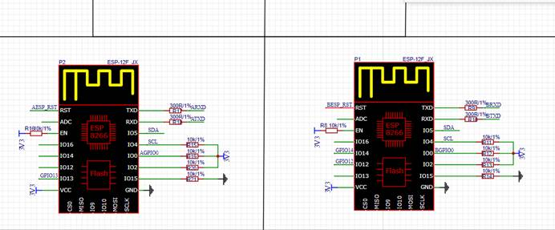

两个芯片设置io4、io5进行软串口通讯

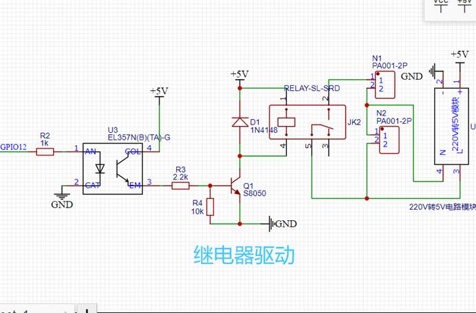

Io12控制继电器

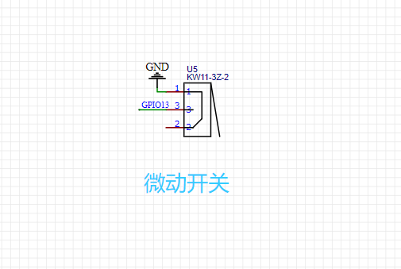

Io13连接微动开关

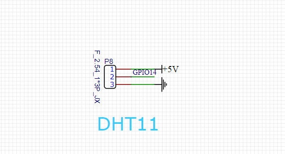

可以添加温湿度传感器

## 4.  PCB

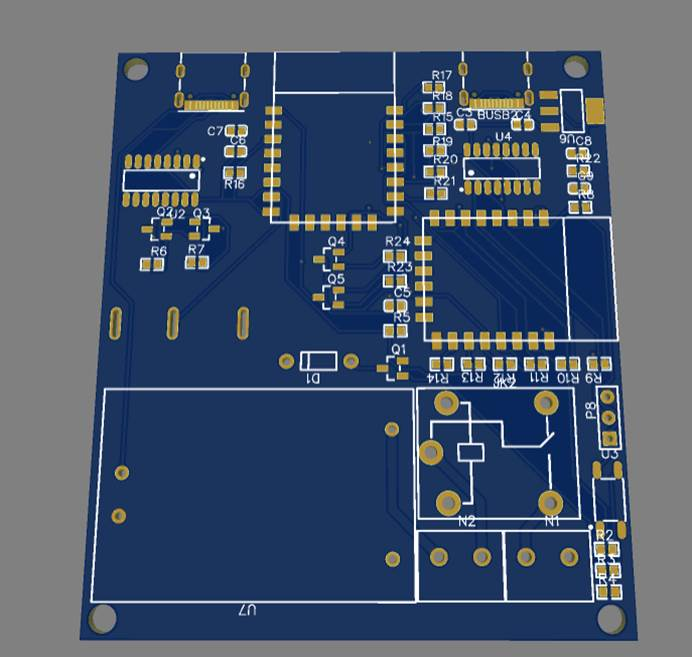

使用了两个type-c接口分别对两个芯片下载程序

左边的刷阿里云的程序，右面的刷HomeKit。

## 5.  阿里云配置

进入阿里云物联网平台新建一个公共实例

https://iot.console.aliyun.com

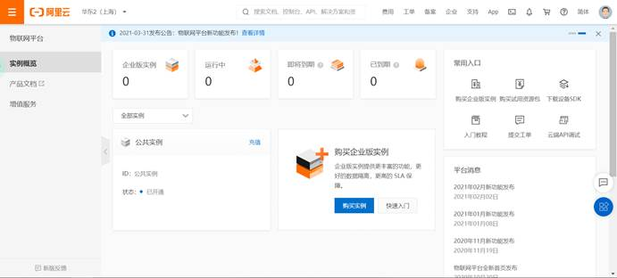

创建一个产品

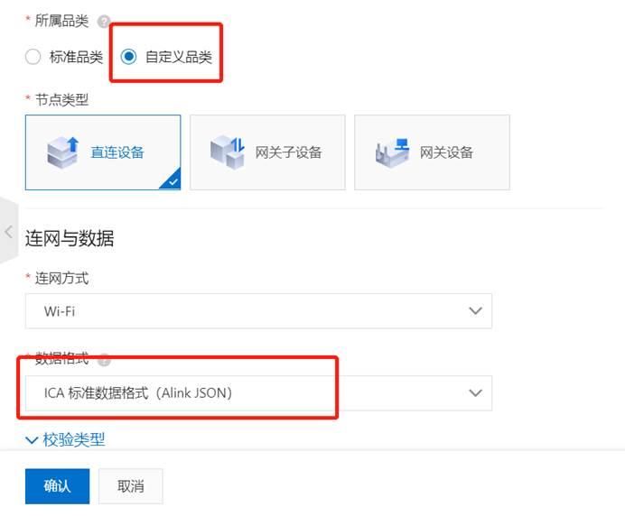

添加一个设备

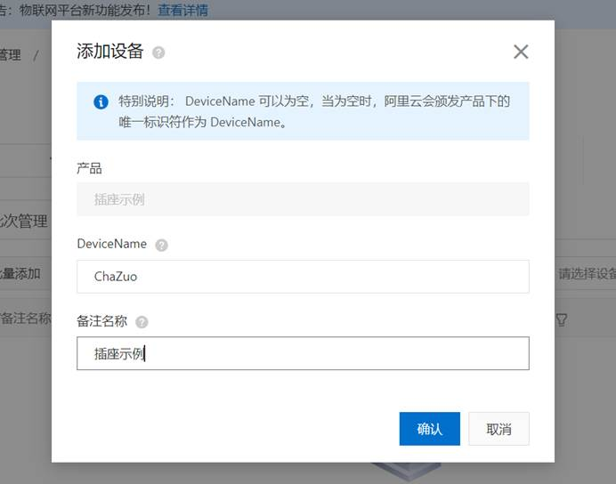

回到产品，功能定义，编辑草稿

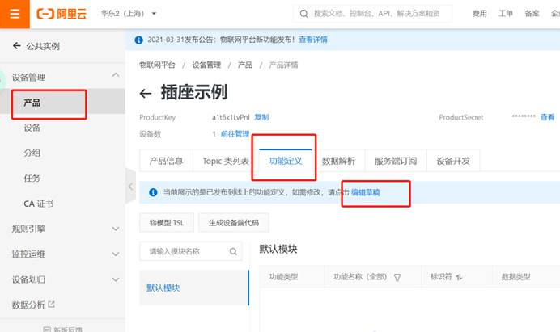

添加一个自定义功能

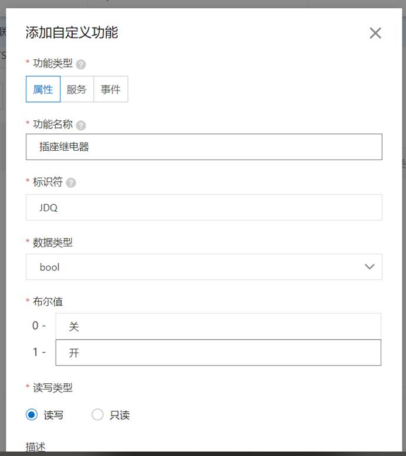

发布上线

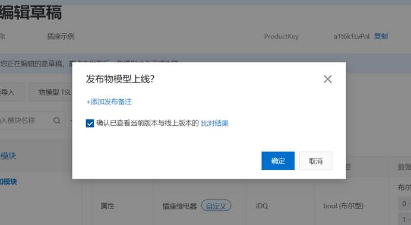

## 6.  阿里云程序

这里用的Arduino环境写8266程序

环境搭建自行搜索

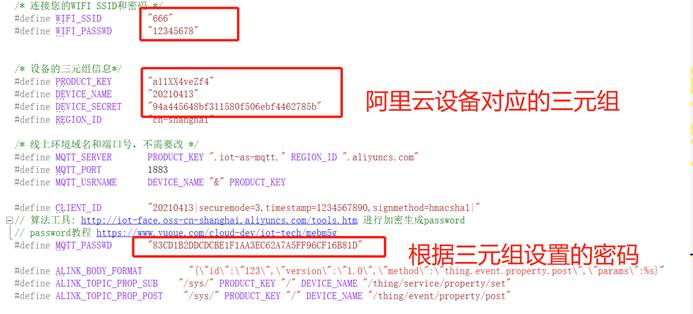

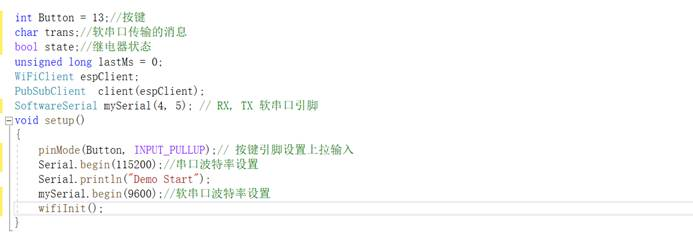

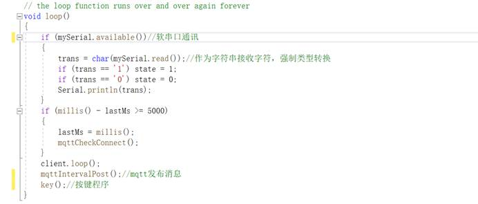

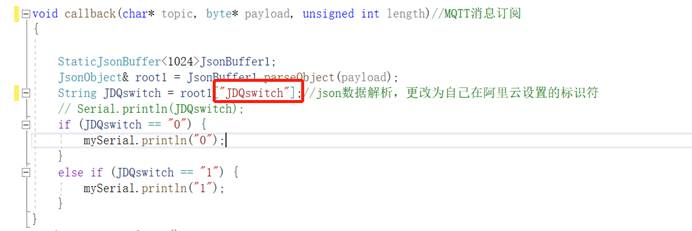

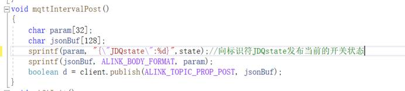

## 7.  HomeKit程序

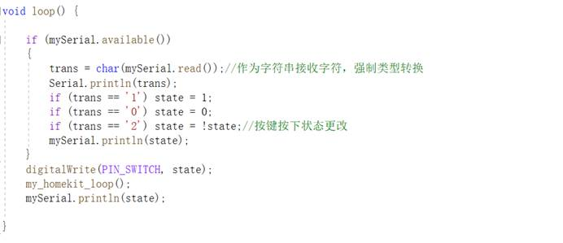

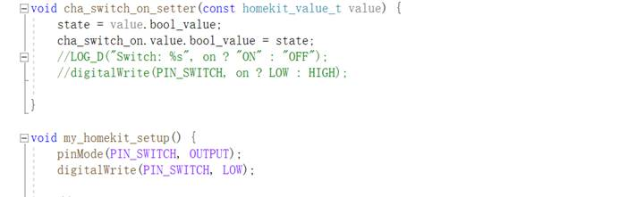

特别注意一下，json库要使用V5版本

Pubsubclient.h也要修改

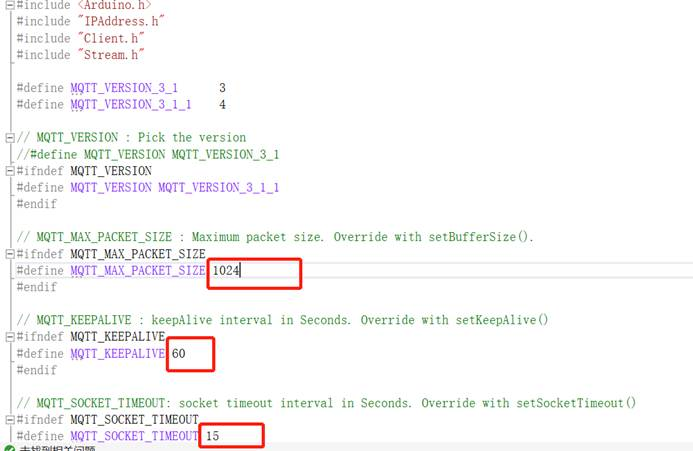

## 8.  微信小程序

首先在新建的产品里新建一个设备，对应微信小程序

打开微信开发者工具，打开下载的程序（开发小程序，微信公众平台要进行设置，自行搜索）

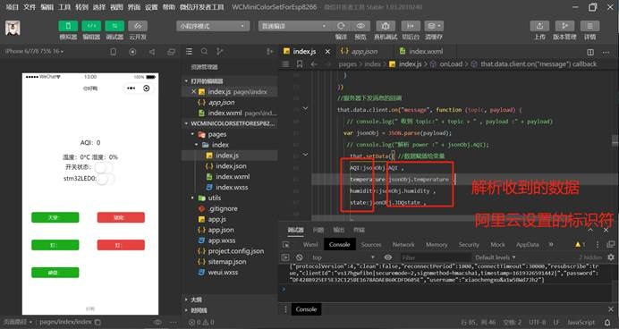

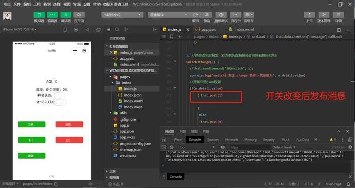

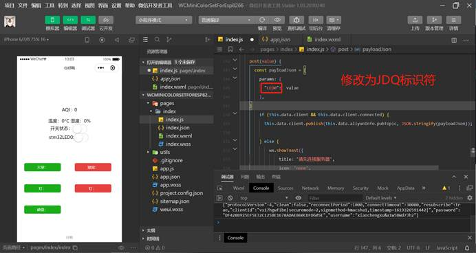

阿里云设置数据流转，将小程序推送的消息转发到插座

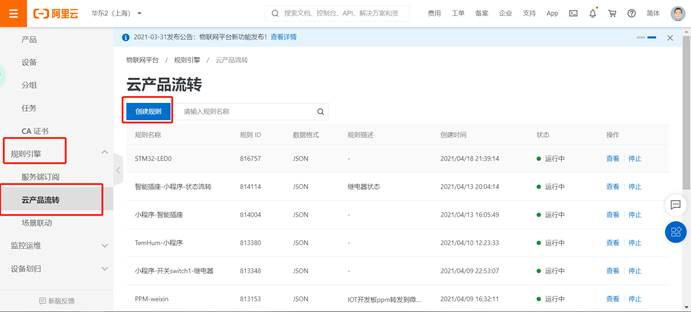

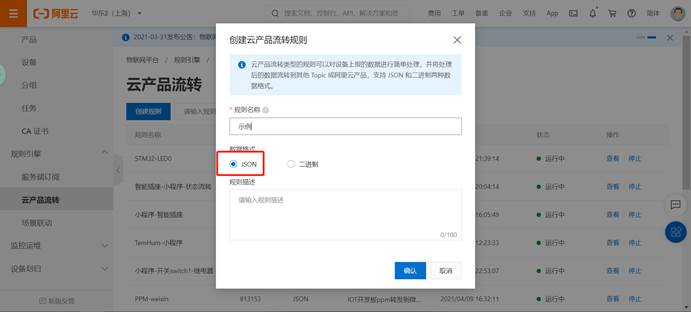

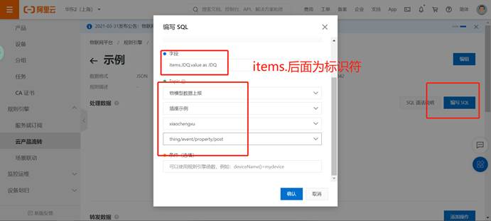

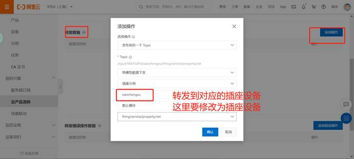

返回去启动规则

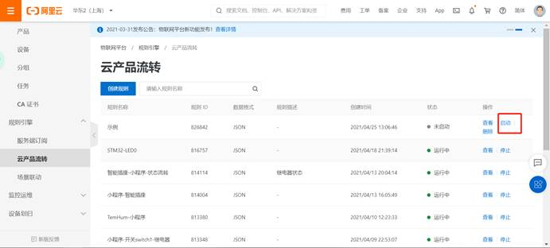

完成后就可以使用小程序控制插座了，插座状态上传是一样的，建立规则把小程序状态流转到小程序

## 9.  HomeKit设置

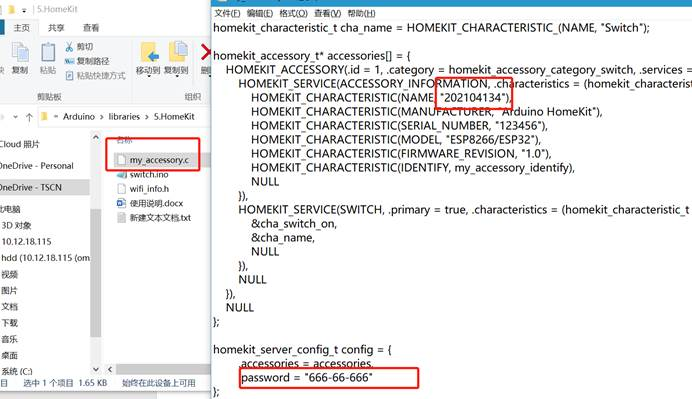

名字时刷入flash ，所以如果在已经刷过homeKit程序的8266，需要清除flash信息（自行搜索）否则app里找不到设备

刷入程序后添加设备，点我没有或无法扫描，之后会弹出设备，输入上面设置的密码，之后按提示操作，HomeKit操作要在一个局域网内。

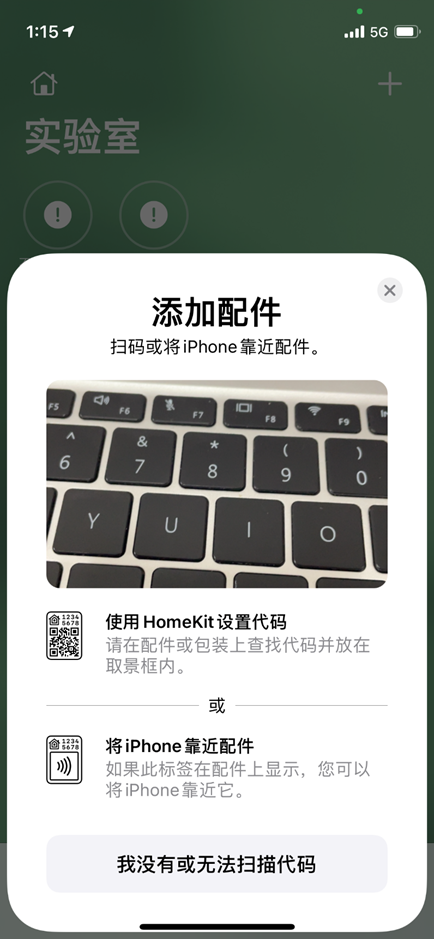

完成之后就可以在家庭app和小程序同时进行控制了。

完成后实物

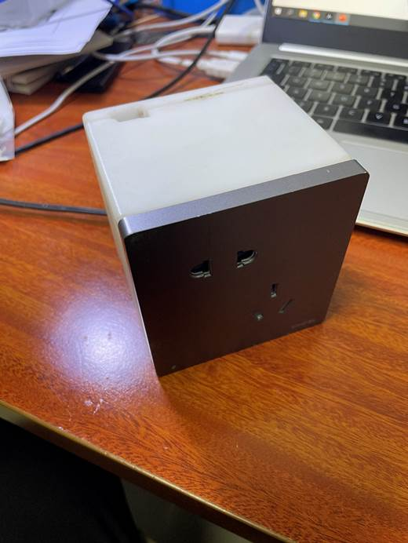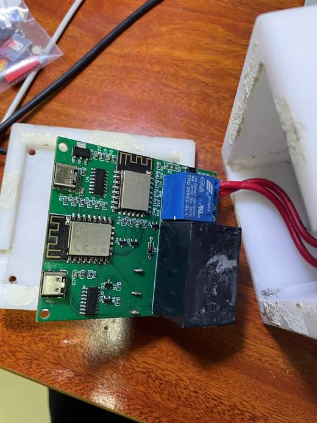

